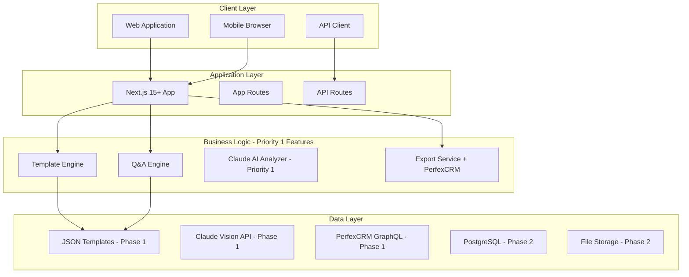

# ChecklistApp - System Architecture

## 🎯 Core Priority Architecture

> ⚠️ **CRITICAL**: This architecture supports the 5 core priority features that MUST be implemented in Phase 1 (Weeks 1-10):
> 1. Template-Based Generation
> 2. Interactive Customization
> 3. AI-Powered Intelligence (Claude API) - Priority 1, NOT Future
> 4. Professional Export (PerfexCRM GraphQL) - Priority 1, NOT Future
> 5. Mobile-Responsive Design

## Architecture Overview

ChecklistApp follows a modular, scalable architecture built on Next.js 15+ with React 19. The system is designed to support multiple checklist generation methods while maintaining simplicity for the MVP phase. The architecture prioritizes flexibility, allowing for progressive enhancement from a simple template system to advanced AI-powered features.



## Core Architecture Principles

### 1. Progressive Enhancement
- **MVP First**: Start with template-based generation
- **Incremental Features**: Add complexity gradually
- **Backward Compatible**: Maintain support for simpler methods
- **User-Driven**: Features based on feedback

### 2. Modular Design
- **Touch Optimized**: Minimum 48x48px touch targets
- **One-Handed Operation**: Bottom navigation, thumb zones
- **Progressive Enhancement**: Core features work on all devices
- **Adaptive Loading**: Reduce features on low-end devices

### 3. Performance Optimization
- **Code Splitting**: Route-based chunking
- **Image Optimization**: Next.js Image with lazy loading
- **Resource Hints**: Preconnect, prefetch, preload
- **Bundle Size**: < 200KB initial JavaScript

## System Components

### Frontend Layer (PWA)

#### Next.js 15+ App Router
```typescript
// app/layout.tsx
export const metadata = {
  manifest: '/manifest.json',
  themeColor: '#000000',
  viewport: 'width=device-width, initial-scale=1, maximum-scale=1',
};

// Core app structure
app/
├── (auth)/
│   ├── login/
│   └── register/
├── (app)/
│   ├── checklist/
│   │   ├── [id]/
│   │   └── new/
│   ├── camera/
│   ├── sync/
│   └── settings/
├── api/
│   ├── claude/
│   ├── sync/
│   └── upload/
└── offline/
```

#### Service Worker Architecture
```javascript
// public/sw.js
const CACHE_VERSION = 'v1';
const STATIC_CACHE = `static-${CACHE_VERSION}`;
const DYNAMIC_CACHE = `dynamic-${CACHE_VERSION}`;
const IMAGE_CACHE = `images-${CACHE_VERSION}`;

// Offline-first strategies
self.addEventListener('fetch', (event) => {
  if (event.request.url.includes('/api/')) {
    // Network first, fallback to cache
    event.respondWith(networkFirst(event.request));
  } else if (event.request.destination === 'image') {
    // Cache first for images
    event.respondWith(cacheFirst(event.request));
  } else {
    // Stale while revalidate for HTML/CSS/JS
    event.respondWith(staleWhileRevalidate(event.request));
  }
});
```

### Data Layer

#### IndexedDB Schema
```typescript
interface LocalDatabase {
  checklists: {
    id: string;
    status: 'draft' | 'active' | 'completed' | 'synced';
    createdAt: Date;
    modifiedAt: Date;
    syncedAt?: Date;
    data: ChecklistData;
  };
  
  photos: {
    id: string;
    checklistId: string;
    taskId: string;
    type: 'before' | 'after' | 'issue';
    blob: Blob;
    metadata: PhotoMetadata;
    uploadStatus: 'pending' | 'uploading' | 'uploaded' | 'failed';
  };
  
  syncQueue: {
    id: string;
    operation: 'create' | 'update' | 'delete';
    entity: 'checklist' | 'task' | 'photo';
    payload: any;
    attempts: number;
    lastAttempt?: Date;
  };
  
  settings: {
    key: string;
    value: any;
  };
}
```

#### Sync Engine
```typescript
class SyncEngine {
  private queue: SyncQueue;
  private connection: ConnectionMonitor;
  
  async sync() {
    if (!this.connection.isOnline) return;
    
    const pending = await this.queue.getPending();
    for (const item of pending) {
      try {
        await this.processSync(item);
        await this.queue.markComplete(item.id);
      } catch (error) {
        await this.queue.markFailed(item.id, error);
      }
    }
  }
  
  private async processSync(item: SyncItem) {
    switch (item.entity) {
      case 'checklist':
        return this.syncChecklist(item);
      case 'photo':
        return this.uploadPhoto(item);
      case 'task':
        return this.syncTask(item);
    }
  }
}
```

### Integration Layer

#### Claude AI Integration
```typescript
// lib/claude.ts
export class ClaudeService {
  async analyzeRoom(photo: Blob): Promise<RoomAnalysis> {
    const base64 = await blobToBase64(photo);
    
    const response = await fetch('/api/claude/vision', {
      method: 'POST',
      body: JSON.stringify({
        image: base64,
        prompt: 'Identify room type and cleaning requirements'
      })
    });
    
    return response.json();
  }
  
  async generateChecklist(
    roomType: string, 
    condition: string,
    context: Context
  ): Promise<Checklist> {
    const response = await fetch('/api/claude/checklist', {
      method: 'POST',
      body: JSON.stringify({
        roomType,
        condition,
        context
      })
    });
    
    return response.json();
  }
}
```

#### PerfexCRM GraphQL Sync
```typescript
// lib/perfex.ts
export class PerfexSync {
  private client: GraphQLClient;
  
  async syncChecklist(checklist: Checklist) {
    // Create project
    const project = await this.createProject({
      name: checklist.name,
      clientid: checklist.clientId,
      status: '2'
    });
    
    // Create milestones (rooms)
    for (const room of checklist.rooms) {
      const milestone = await this.createMilestone({
        project_id: project.id,
        name: room.name,
        description: room.description
      });
      
      // Create tasks
      for (const task of room.tasks) {
        await this.createTask({
          milestone: milestone.id,
          name: task.name,
          description: task.description,
          customFields: task.metadata
        });
      }
    }
  }
}
```

## Security Architecture

### Authentication & Authorization
```typescript
// Multi-layer security
1. JWT tokens with refresh rotation
2. Biometric authentication (fingerprint/face)
3. PIN fallback for quick access
4. Role-based permissions (cleaner/supervisor/admin)
```

### Data Protection
```typescript
// Encryption at rest and in transit
1. IndexedDB encryption using Web Crypto API
2. TLS 1.3 for all API communications
3. Photo encryption before upload
4. Sensitive data never in localStorage
```

### API Security
```typescript
// API protection strategies
1. Rate limiting per device/user
2. CORS with strict origins
3. CSP headers for XSS protection
4. API key rotation for Claude/Perfex
```

## Performance Architecture

### Progressive Loading Strategy with React 19
```typescript
// Priority-based resource loading with Partial Prerendering
Priority 1: Static shell (prerendered at build time)
Priority 2: React Server Components (streamed)
Priority 3: Client Components (hydrated progressively)
Priority 4: Service worker registration
Priority 5: Next route prefetch with View Transitions
Priority 6: Images with Next.js Image optimization

// app/checklist/[id]/page.tsx - Partial Prerendering
import { unstable_ViewTransition as ViewTransition } from 'react';

export default async function ChecklistPage({ params }) {
  // Static parts rendered at build time
  const staticData = await getStaticChecklistData(params.id);
  
  // Dynamic parts streamed at request time
  const dynamicDataPromise = getDynamicChecklistData(params.id);
  
  return (
    <ViewTransition default="slide-in">
      <ChecklistHeader data={staticData} />
      <Suspense fallback={<TaskListSkeleton />}>
        <TaskList promise={dynamicDataPromise} />
      </Suspense>
    </ViewTransition>
  );
}
```

### Caching Strategy
```typescript
// Multi-tier cache system
L1: Memory cache (React Query)
L2: IndexedDB (structured data)
L3: Cache API (assets)
L4: CDN edge cache
L5: Server cache
```

### Bundle Optimization
```typescript
// Next.js optimization config
module.exports = {
  compiler: {
    removeConsole: process.env.NODE_ENV === 'production',
  },
  images: {
    formats: ['image/avif', 'image/webp'],
    deviceSizes: [640, 750, 1080, 1200],
  },
  experimental: {
    optimizeCss: true,
    optimizePackageImports: ['lodash', 'date-fns'],
  }
};
```

## Deployment Architecture

### Infrastructure Stack
```yaml
Hosting: Vercel (Next.js optimized)
CDN: Cloudflare (global edge network)
Storage: AWS S3 (photos, backups)
Database: IndexedDB (primary), PostgreSQL (backup)
APIs: Claude AI, PerfexCRM GraphQL
Monitoring: Vercel Analytics, Sentry
```

### Deployment Pipeline
```yaml
Development:
  - Local Next.js dev server
  - Local service worker testing
  - IndexedDB inspection tools

Staging:
  - Vercel preview deployments
  - E2E testing with Playwright
  - Performance testing (Lighthouse)

Production:
  - Vercel production deployment
  - Automatic CDN invalidation
  - Progressive rollout (10% → 50% → 100%)
  - Instant rollback capability
```

## Scalability Architecture

### Horizontal Scaling
- **Edge Functions**: Distributed compute at CDN level
- **Serverless APIs**: Auto-scaling Next.js API routes
- **Queue Processing**: Background job distribution
- **Load Balancing**: Geographic distribution

### Vertical Scaling
- **Resource Optimization**: Adaptive quality based on device
- **Lazy Loading**: On-demand component loading
- **Data Pagination**: Incremental data fetching
- **Image Optimization**: Responsive image delivery

## Monitoring & Observability

### Performance Monitoring
```typescript
// Web Vitals tracking
export function reportWebVitals(metric: NextWebVitalsMetric) {
  if (metric.label === 'web-vital') {
    analytics.track('Web Vital', {
      name: metric.name,
      value: metric.value,
      rating: metric.rating
    });
  }
}
```

### Error Tracking
```typescript
// Sentry integration
Sentry.init({
  dsn: process.env.NEXT_PUBLIC_SENTRY_DSN,
  environment: process.env.NODE_ENV,
  beforeSend(event, hint) {
    // Filter sensitive data
    return event;
  }
});
```

### Usage Analytics
```typescript
// Custom analytics events
analytics.track('Checklist Started', {
  roomType: 'bathroom',
  method: 'camera',
  offline: !navigator.onLine
});
```

## Disaster Recovery

### Backup & Recovery Strategy

#### Backup Mechanisms
1. **Local Backup**
   - **Primary**: IndexedDB data persisted automatically
   - **Secondary**: Critical data mirrored to localStorage
   - **Frequency**: Real-time for critical data, hourly for full backup
   - **Retention**: Last 7 local backups maintained

2. **Cloud Backup**
   - **Automatic Sync**: Every 6 hours when online
   - **Incremental Backups**: Only changed data synced
   - **Full Backup**: Weekly complete data snapshot
   - **Storage**: Supabase with S3 for photos
   - **Encryption**: AES-256 for sensitive data

3. **Export Options**
   - **JSON Export**: Complete data structure
   - **PDF Export**: Human-readable checklist format
   - **CSV Export**: Tabular data for spreadsheets
   - **Photo Archive**: ZIP file with all images

#### Recovery Procedures
1. **Automatic Recovery**
   - App reinstall detects cloud backup
   - Prompts user to restore from latest backup
   - Merges local and cloud data intelligently
   - Handles version migrations automatically

2. **Manual Recovery**
   - Import from JSON backup file
   - Selective restore of specific checklists
   - Photo recovery from cloud storage
   - Settings and preferences restoration

3. **Disaster Recovery**
   - **RPO (Recovery Point Objective)**: 6 hours
   - **RTO (Recovery Time Objective)**: 15 minutes
   - **Data Integrity**: Checksums for validation
   - **Rollback**: Previous version restoration

### Failover Mechanisms
1. **Service Worker**: Fallback to cached responses
2. **API Gateway**: Multiple endpoint fallbacks with health checks
3. **Photo Upload**: Retry queue with exponential backoff
4. **Sync Conflicts**: Manual resolution UI with diff view
5. **Database Failover**: Read replicas for high availability
6. **CDN Fallback**: Multiple CDN providers for assets

---

*This architecture ensures ChecklistApp delivers a resilient, performant, and user-friendly experience for cleaning professionals working in challenging mobile environments.*