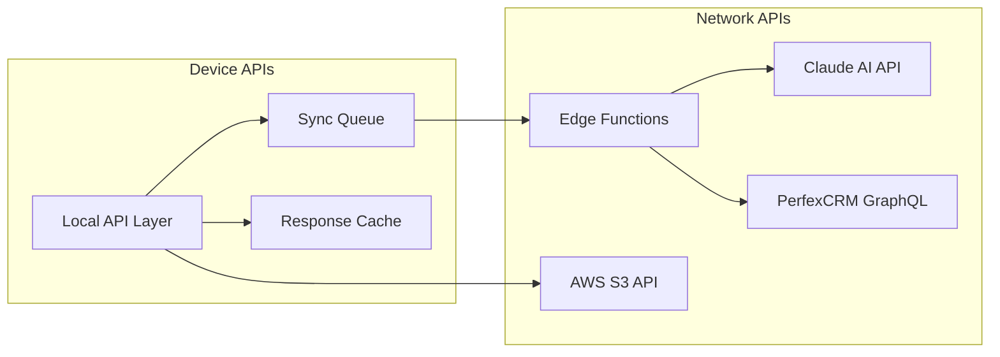

# ChecklistApp - API Design

## 🎯 Core Priority APIs (MUST BE IMPLEMENTED FIRST)

These APIs support the 5 core priority features and MUST be implemented before any other APIs:

1. **Template API** - Supports Template-Based Generation
2. **Interactive API** - Supports Q&A Customization
3. **Claude Vision API** - Supports AI-Powered Intelligence
4. **PerfexCRM GraphQL API** - Supports Professional Export
5. **Export API** - Supports PDF/Markdown generation

> ⚠️ **CRITICAL**: All 5 priority APIs must be functional before implementing any other API endpoints. Authentication and other features come AFTER these are complete.

## API Architecture Overview

The API layer is designed to be modular and scalable. The MVP uses simple Next.js API routes with JSON data. Future phases will add database persistence, authentication, and external service integrations.



## Core API Principles

### 1. Offline-First Design
- **Local Processing**: All operations work without network
- **Queue Management**: Failed requests queued for retry
- **Optimistic Updates**: Immediate UI feedback
- **Conflict Resolution**: Automatic and manual merge strategies

### 2. Mobile Optimization
- **Minimal Payloads**: Only essential data transferred
- **Compression**: Brotli compression for all responses
- **Batch Operations**: Combine multiple requests
- **Progressive Sync**: Priority-based synchronization

### 3. Security & Privacy
- **Local Encryption**: Sensitive data encrypted on device
- **Token Management**: Secure token storage and rotation
- **API Rate Limiting**: Prevent abuse and control costs
- **Data Minimization**: Only sync necessary data

## API Endpoints

### Local Device APIs

#### Camera API
```typescript
interface CameraAPI {
  // Capture photo with automatic optimization
  capture(options: CaptureOptions): Promise<Photo>;
  
  // Batch capture for before/after
  captureSequence(count: number): Promise<Photo[]>;
  
  // Get photo from gallery
  selectFromGallery(): Promise<Photo>;
}

interface CaptureOptions {
  quality: 'low' | 'medium' | 'high';
  maxWidth: number;
  maxHeight: number;
  compress: boolean;
}

interface Photo {
  id: string;
  blob: Blob;
  thumbnail: Blob;
  metadata: {
    timestamp: Date;
    location?: Coordinates;
    orientation: number;
    size: number;
  };
}
```

#### Geolocation API
```typescript
interface GeolocationAPI {
  // Get current position with fallbacks
  getCurrentPosition(): Promise<Position>;
  
  // Watch position for route tracking
  watchPosition(callback: PositionCallback): WatchId;
  
  // Geocode address
  geocodeAddress(lat: number, lng: number): Promise<Address>;
  
  // Indoor positioning using WiFi/Bluetooth
  getIndoorPosition(): Promise<IndoorPosition>;
}

interface Position {
  coords: {
    latitude: number;
    longitude: number;
    accuracy: number;
  };
  timestamp: number;
  address?: Address;
}
```

#### Local Storage API
```typescript
interface LocalStorageAPI {
  // Checklist operations
  checklists: {
    create(data: ChecklistInput): Promise<Checklist>;
    update(id: string, data: Partial<Checklist>): Promise<Checklist>;
    delete(id: string): Promise<void>;
    get(id: string): Promise<Checklist>;
    list(filter?: FilterOptions): Promise<Checklist[]>;
  };
  
  // Photo operations
  photos: {
    store(photo: Photo, checklistId: string): Promise<string>;
    retrieve(id: string): Promise<Photo>;
    delete(id: string): Promise<void>;
    listByChecklist(checklistId: string): Promise<Photo[]>;
  };
  
  // Sync queue operations
  syncQueue: {
    add(operation: SyncOperation): Promise<void>;
    process(): Promise<SyncResult[]>;
    retry(id: string): Promise<SyncResult>;
    clear(): Promise<void>;
  };
}
```

### Claude AI API Integration

#### Vision Analysis
```typescript
// POST /api/claude/vision
interface VisionRequest {
  image: string; // Base64 encoded
  context?: {
    buildingType?: string;
    previousRooms?: string[];
    specialRequirements?: string[];
  };
}

interface VisionResponse {
  roomType: 'bathroom' | 'bedroom' | 'kitchen' | 'office' | 'hallway' | 'other';
  condition: 'clean' | 'light' | 'moderate' | 'heavy' | 'extreme';
  features: string[]; // ['carpet', 'hardwood', 'windows', 'mirrors']
  issues: string[]; // ['stains', 'dust', 'clutter']
  estimatedTime: number; // minutes
  confidence: number; // 0-1
}

// Example implementation
async function analyzeRoom(photo: Blob): Promise<VisionResponse> {
  const base64 = await blobToBase64(photo);
  
  const response = await fetch('/api/claude/vision', {
    method: 'POST',
    headers: {
      'Content-Type': 'application/json',
      'X-Device-Id': getDeviceId(),
    },
    body: JSON.stringify({
      image: base64,
      context: {
        buildingType: getCurrentBuilding().type,
        previousRooms: getCompletedRooms(),
      }
    })
  });
  
  if (!response.ok && !navigator.onLine) {
    // Queue for later processing
    await queueVisionRequest(photo);
    return estimateLocally(photo); // Fallback
  }
  
  return response.json();
}
```

#### Checklist Generation
```typescript
// POST /api/claude/checklist
interface ChecklistRequest {
  roomType: string;
  condition: string;
  features: string[];
  requirements?: {
    timeLimit?: number;
    deepClean?: boolean;
    supplies?: string[];
  };
  template?: string; // Use existing template as base
}

interface ChecklistResponse {
  tasks: Task[];
  estimatedTime: number;
  supplies: Supply[];
  safety: SafetyNote[];
  quality: QualityStandard[];
}

interface Task {
  id: string;
  name: string;
  description: string;
  steps: string[];
  estimatedTime: number;
  priority: 'critical' | 'high' | 'medium' | 'low';
  supplies: string[];
  validation: {
    photo?: boolean;
    signature?: boolean;
    note?: boolean;
  };
}
```

#### Quality Validation
```typescript
// POST /api/claude/validate
interface ValidationRequest {
  beforePhoto: string; // Base64
  afterPhoto: string; // Base64
  task: Task;
  completionNotes?: string;
}

interface ValidationResponse {
  status: 'approved' | 'needs_work' | 'failed';
  score: number; // 0-100
  feedback: string[];
  issues: {
    area: string;
    description: string;
    severity: 'minor' | 'major' | 'critical';
  }[];
  suggestions: string[];
}
```

### PerfexCRM GraphQL API

#### Sync Operations
```typescript
// POST /api/sync/perfex
interface PerfexSyncRequest {
  operation: 'create' | 'update' | 'delete';
  entity: 'project' | 'milestone' | 'task' | 'checklist';
  data: any;
  localId: string;
}

interface PerfexSyncResponse {
  success: boolean;
  remoteId?: string;
  error?: string;
  conflicts?: Conflict[];
}

// GraphQL Mutations
const mutations = {
  createProject: `
    mutation CreateProject($input: ProjectInput!) {
      addTblprojects(
        name: $input.name
        clientid: $input.clientId
        status: $input.status
      ) {
        id
        name
      }
    }
  `,
  
  createMilestone: `
    mutation CreateMilestone($input: MilestoneInput!) {
      addTblmilestones(
        name: $input.name
        project_id: $input.projectId
        description: $input.description
      ) {
        id
        name
      }
    }
  `,
  
  createTask: `
    mutation CreateTask($input: TaskInput!) {
      addTbltasks(
        name: $input.name
        rel_id: $input.relId
        rel_type: "project"
        milestone: $input.milestone
        description: $input.description
      ) {
        id
        name
      }
    }
  `,
  
  addCustomField: `
    mutation AddCustomField($input: CustomFieldInput!) {
      addTblcustomfieldsvalues(
        relid: $input.taskId
        fieldid: $input.fieldId
        value: $input.value
        fieldto: "tasks"
      ) {
        id
      }
    }
  `
};
```

#### Batch Sync
```typescript
// POST /api/sync/batch
interface BatchSyncRequest {
  checklists: ChecklistSync[];
  photos: PhotoSync[];
  priority: 'high' | 'normal' | 'low';
}

interface ChecklistSync {
  localId: string;
  status: 'pending' | 'completed';
  data: Checklist;
  lastModified: Date;
}

interface PhotoSync {
  localId: string;
  checklistId: string;
  url?: string; // Already uploaded to S3
  needsUpload: boolean;
}

// Sync strategy
class SyncStrategy {
  async sync(request: BatchSyncRequest): Promise<SyncResult> {
    // Priority queue processing
    const queue = this.prioritize(request);
    
    // Process in batches to avoid timeout
    const batchSize = 10;
    const results = [];
    
    for (let i = 0; i < queue.length; i += batchSize) {
      const batch = queue.slice(i, i + batchSize);
      const batchResults = await this.processBatch(batch);
      results.push(...batchResults);
      
      // Update progress
      await this.updateProgress(i / queue.length);
    }
    
    return this.consolidateResults(results);
  }
}
```

### Photo Storage API (S3)

#### Upload Operations
```typescript
// POST /api/photos/upload
interface PhotoUploadRequest {
  photo: File;
  metadata: {
    checklistId: string;
    taskId: string;
    type: 'before' | 'after' | 'issue';
    timestamp: Date;
    location?: Coordinates;
  };
}

interface PhotoUploadResponse {
  url: string;
  thumbnailUrl: string;
  id: string;
  size: number;
}

// Multipart upload for large photos
class PhotoUploader {
  async upload(photo: File, metadata: Metadata): Promise<string> {
    if (photo.size > 5 * 1024 * 1024) { // > 5MB
      return this.multipartUpload(photo, metadata);
    }
    
    return this.simpleUpload(photo, metadata);
  }
  
  private async multipartUpload(photo: File, metadata: Metadata) {
    const chunks = this.createChunks(photo, 1024 * 1024); // 1MB chunks
    const uploadId = await this.initiateMultipart(metadata);
    
    const parts = await Promise.all(
      chunks.map((chunk, index) => 
        this.uploadPart(uploadId, chunk, index)
      )
    );
    
    return this.completeMultipart(uploadId, parts);
  }
}
```

## Offline Sync Architecture

### Sync Queue Management
```typescript
interface SyncQueue {
  // Add operation to queue
  enqueue(operation: SyncOperation): Promise<void>;
  
  // Process queue when online
  process(): Promise<void>;
  
  // Get queue status
  getStatus(): QueueStatus;
  
  // Clear completed items
  cleanup(): Promise<void>;
}

interface SyncOperation {
  id: string;
  type: 'api_call' | 'photo_upload' | 'data_sync';
  priority: number; // 0-10, higher = more important
  payload: any;
  attempts: number;
  lastAttempt?: Date;
  error?: string;
}

interface QueueStatus {
  pending: number;
  processing: number;
  failed: number;
  completed: number;
}
```

### Conflict Resolution
```typescript
interface ConflictResolver {
  // Detect conflicts
  detect(local: any, remote: any): Conflict[];
  
  // Auto-resolve if possible
  autoResolve(conflict: Conflict): Resolution | null;
  
  // Present to user for manual resolution
  presentToUser(conflicts: Conflict[]): Promise<Resolution[]>;
}

interface Conflict {
  field: string;
  localValue: any;
  remoteValue: any;
  localTimestamp: Date;
  remoteTimestamp: Date;
  severity: 'low' | 'medium' | 'high';
}

interface Resolution {
  conflictId: string;
  strategy: 'local' | 'remote' | 'merge';
  mergedValue?: any;
}
```

## WebSocket Real-time Updates

### Connection Management
```typescript
// Real-time sync when online
class RealtimeSync {
  private ws: WebSocket;
  private reconnectAttempts = 0;
  
  connect() {
    this.ws = new WebSocket('wss://api.checklistapp.com/sync');
    
    this.ws.onopen = () => {
      this.reconnectAttempts = 0;
      this.syncPendingChanges();
    };
    
    this.ws.onmessage = (event) => {
      const update = JSON.parse(event.data);
      this.handleRemoteUpdate(update);
    };
    
    this.ws.onclose = () => {
      this.scheduleReconnect();
    };
  }
  
  private scheduleReconnect() {
    const delay = Math.min(1000 * 2 ** this.reconnectAttempts, 30000);
    setTimeout(() => this.connect(), delay);
    this.reconnectAttempts++;
  }
}
```

## API Rate Limiting & Quotas

### Claude AI Limits
```typescript
const claudeLimits = {
  vision: {
    requestsPerMinute: 10,
    requestsPerDay: 1000,
    maxImageSize: 10 * 1024 * 1024, // 10MB
  },
  text: {
    requestsPerMinute: 20,
    requestsPerDay: 2000,
    maxTokens: 4096,
  }
};

class RateLimiter {
  async checkLimit(api: string): Promise<boolean> {
    const usage = await this.getUsage(api);
    const limit = claudeLimits[api];
    
    if (usage.minute >= limit.requestsPerMinute) {
      await this.wait(60000); // Wait 1 minute
      return false;
    }
    
    if (usage.day >= limit.requestsPerDay) {
      throw new Error('Daily limit exceeded');
    }
    
    return true;
  }
}
```

## Error Handling

### Retry Strategy
```typescript
class RetryStrategy {
  async execute<T>(
    fn: () => Promise<T>,
    options: RetryOptions = {}
  ): Promise<T> {
    const {
      maxAttempts = 3,
      backoff = 'exponential',
      initialDelay = 1000,
    } = options;
    
    for (let attempt = 1; attempt <= maxAttempts; attempt++) {
      try {
        return await fn();
      } catch (error) {
        if (attempt === maxAttempts) throw error;
        
        if (!this.isRetryable(error)) throw error;
        
        const delay = this.calculateDelay(attempt, backoff, initialDelay);
        await this.wait(delay);
      }
    }
  }
  
  private isRetryable(error: any): boolean {
    // Network errors, timeouts, 5xx errors
    return error.code === 'NETWORK_ERROR' ||
           error.code === 'TIMEOUT' ||
           (error.status >= 500 && error.status < 600);
  }
}
```

## API Documentation

### OpenAPI Specification
```yaml
openapi: 3.0.0
info:
  title: ChecklistApp Mobile API
  version: 1.0.0
  description: Mobile-first PWA API for cleaning checklist management

servers:
  - url: https://api.checklistapp.com/v1
    description: Production
  - url: https://staging-api.checklistapp.com/v1
    description: Staging

paths:
  /claude/vision:
    post:
      summary: Analyze room photo
      requestBody:
        required: true
        content:
          application/json:
            schema:
              $ref: '#/components/schemas/VisionRequest'
      responses:
        200:
          description: Analysis complete
          content:
            application/json:
              schema:
                $ref: '#/components/schemas/VisionResponse'
                
  /sync/checklist:
    post:
      summary: Sync checklist to CRM
      requestBody:
        required: true
        content:
          application/json:
            schema:
              $ref: '#/components/schemas/ChecklistSync'
      responses:
        200:
          description: Sync successful
          content:
            application/json:
              schema:
                $ref: '#/components/schemas/SyncResponse'
```

---

*This API design ensures ChecklistApp delivers reliable, performant, and intelligent functionality for cleaning professionals, regardless of network conditions or device capabilities.*