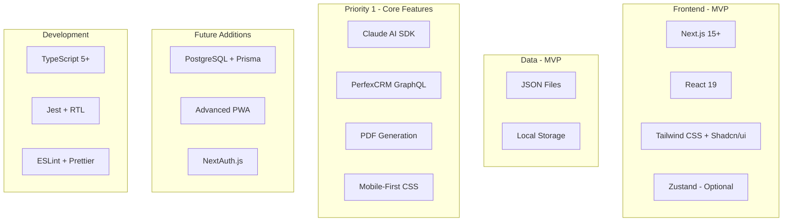

# ChecklistApp - Technology Stack

## 🎯 Core Priority Technology Requirements

These technologies are REQUIRED to support the 5 core priority features:

1. **Mobile-Responsive**: Tailwind CSS + responsive design system
2. **Template Engine**: Next.js + React for dynamic generation
3. **Interactive UI**: React 19 + form handling for Q&A
4. **AI Integration**: Claude SDK + Vision API (Priority 1, not future)
5. **Export System**: PDF libraries + PerfexCRM GraphQL client

> ⚠️ **CRITICAL**: All priority technologies must be configured and operational BEFORE adding any other tech stack components.

## Stack Overview

The technology stack prioritizes the 5 core features first, with all supporting technologies configured to enable these priorities.



## Core Technologies

### Framework: Next.js 15+

#### Why Next.js?
- **App Router**: Modern React patterns
- **File-based Routing**: Simple, intuitive structure
- **API Routes**: Built-in backend capabilities
- **Static Export**: Option for static deployment
- **Image Optimization**: Automatic optimization
- **Fast Refresh**: Excellent developer experience

#### Configuration for Next.js 15.1 + React 19
```typescript
// next.config.js
import withPWA from 'next-pwa';

const nextConfig = {
  reactStrictMode: true,
  images: {
    formats: ['image/avif', 'image/webp'],
    deviceSizes: [390, 430, 768, 1024],
    imageSizes: [16, 32, 48, 64, 96],
  },
  experimental: {
    // React 19 and Next.js 15.1 features
    ppr: true, // Partial Prerendering
    reactCompiler: true, // React Compiler optimization
    serverActions: {
      bodySizeLimit: '2mb', // For photo uploads
      allowedOrigins: ['localhost:3000', 'app.checklistapp.com'],
    },
    optimizeCss: true,
    optimizePackageImports: [
      '@radix-ui/react-*',
      'dexie',
      'date-fns',
      '@tanstack/react-query',
    ],
    webVitalsAttribution: ['CLS', 'LCP', 'INP'],
  },
  // TypeScript for React 19
  typescript: {
    ignoreBuildErrors: false,
  },
};

export default withPWA({
  dest: 'public',
  register: true,
  skipWaiting: true,
  disable: process.env.NODE_ENV === 'development',
  runtimeCaching: [
    {
      urlPattern: /^https:\/\/api\.anthropic\.com\/.*/i,
      handler: 'NetworkFirst',
      options: {
        cacheName: 'claude-api-cache',
        expiration: {
          maxEntries: 10,
          maxAgeSeconds: 60 * 60 * 24, // 24 hours
        },
      },
    },
  ],
})(nextConfig);
```

### UI Framework: Tailwind CSS + Radix UI

#### Why This Combination?
- **Tailwind CSS**: Utility-first, small bundle, mobile-optimized
- **Radix UI**: Accessible, unstyled, touch-friendly primitives
- **Tailwind Variants**: Type-safe component variants

#### Mobile-First Components
```typescript
// components/ui/button.tsx
import { cva } from 'class-variance-authority';

export const buttonVariants = cva(
  'inline-flex items-center justify-center rounded-lg font-medium transition-colors focus-visible:outline-none focus-visible:ring-2 disabled:pointer-events-none disabled:opacity-50',
  {
    variants: {
      variant: {
        default: 'bg-primary text-primary-foreground active:scale-95',
        outline: 'border border-input bg-background active:bg-accent',
      },
      size: {
        default: 'h-12 px-4 py-2', // 48px height for touch
        sm: 'h-10 px-3',
        lg: 'h-14 px-8',
        icon: 'h-12 w-12', // Square touch target
      },
    },
    defaultVariants: {
      variant: 'default',
      size: 'default',
    },
  }
);
```

### State Management

#### Local State: Zustand
```typescript
// stores/checklist.store.ts
import { create } from 'zustand';
import { persist, createJSONStorage } from 'zustand/middleware';

interface ChecklistStore {
  activeChecklist: Checklist | null;
  setActiveChecklist: (checklist: Checklist) => void;
  updateTask: (taskId: string, update: Partial<Task>) => void;
}

export const useChecklistStore = create<ChecklistStore>()(
  persist(
    (set) => ({
      activeChecklist: null,
      setActiveChecklist: (checklist) => set({ activeChecklist: checklist }),
      updateTask: (taskId, update) => set((state) => ({
        activeChecklist: {
          ...state.activeChecklist!,
          tasks: state.activeChecklist!.tasks.map(task =>
            task.id === taskId ? { ...task, ...update } : task
          ),
        },
      })),
    }),
    {
      name: 'checklist-storage',
      storage: createJSONStorage(() => localStorage),
    }
  )
);
```

#### Server State: TanStack Query v5 with Server Actions
```typescript
// hooks/use-claude.ts
import { useMutation } from '@tanstack/react-query';
import { analyzeRoom } from '@/actions/claude';

export function useRoomAnalysis() {
  return useMutation({
    mutationFn: async (photo: Blob) => {
      // Using Server Action instead of API route
      const base64 = await blobToBase64(photo);
      return analyzeRoom(base64);
    },
    onSuccess: (data) => {
      // Cache result in IndexedDB
      db.analyses.add(data);
    },
  });
}

// actions/claude.ts
'use server';

import { Anthropic } from '@anthropic-ai/sdk';

export async function analyzeRoom(imageBase64: string) {
  const client = new Anthropic({
    apiKey: process.env.ANTHROPIC_API_KEY!,
  });
  
  const response = await client.messages.create({
    model: 'claude-3-5-sonnet-20241022',
    max_tokens: 1024,
    messages: [{
      role: 'user',
      content: [
        {
          type: 'image',
          source: {
            type: 'base64',
            media_type: 'image/jpeg',
            data: imageBase64,
          },
        },
        {
          type: 'text',
          text: 'Analyze this room for cleaning...',
        },
      ],
    }],
  });
  
  return parseAnalysis(response);
}
```

### Local Database: Dexie.js (IndexedDB)

#### Why Dexie?
- **TypeScript Support**: Full type safety
- **Reactive Queries**: Live updating queries
- **Migration Support**: Schema versioning
- **Performance**: Optimized for mobile

#### Database Schema
```typescript
// lib/db.ts
import Dexie, { Table } from 'dexie';

export interface ChecklistRecord {
  id?: string;
  name: string;
  status: 'draft' | 'active' | 'completed' | 'synced';
  createdAt: Date;
  modifiedAt: Date;
  syncedAt?: Date;
  data: any;
}

export interface PhotoRecord {
  id?: string;
  checklistId: string;
  taskId: string;
  type: 'before' | 'after' | 'issue';
  blob: Blob;
  thumbnail: Blob;
  uploadStatus: 'pending' | 'uploaded' | 'failed';
}

class ChecklistDatabase extends Dexie {
  checklists!: Table<ChecklistRecord>;
  photos!: Table<PhotoRecord>;
  syncQueue!: Table<any>;

  constructor() {
    super('ChecklistApp');
    
    this.version(1).stores({
      checklists: '++id, status, createdAt, syncedAt',
      photos: '++id, checklistId, taskId, uploadStatus',
      syncQueue: '++id, type, priority, attempts',
    });
  }
}

export const db = new ChecklistDatabase();
```

### Service Worker: Workbox

**Primary Approach**: We use Workbox for production due to its robust caching strategies, precaching capabilities, and battle-tested reliability. The vanilla Service Worker examples in other documentation are provided for educational purposes and custom implementations if needed.

#### Configuration
```javascript
// public/sw.js
import { precacheAndRoute } from 'workbox-precaching';
import { registerRoute } from 'workbox-routing';
import { StaleWhileRevalidate, NetworkFirst, CacheFirst } from 'workbox-strategies';
import { ExpirationPlugin } from 'workbox-expiration';
import { BackgroundSyncPlugin } from 'workbox-background-sync';

// Precache app shell
precacheAndRoute(self.__WB_MANIFEST);

// Cache images
registerRoute(
  ({ request }) => request.destination === 'image',
  new CacheFirst({
    cacheName: 'images',
    plugins: [
      new ExpirationPlugin({
        maxEntries: 100,
        maxAgeSeconds: 30 * 24 * 60 * 60, // 30 days
      }),
    ],
  })
);

// API calls with background sync
const bgSyncPlugin = new BackgroundSyncPlugin('api-queue', {
  maxRetentionTime: 24 * 60, // 24 hours
});

registerRoute(
  ({ url }) => url.pathname.startsWith('/api/'),
  new NetworkFirst({
    cacheName: 'api-cache',
    plugins: [bgSyncPlugin],
  })
);
```

### AI Integration: Claude SDK

#### Custom SDK Wrapper
```typescript
// lib/claude.ts
import Anthropic from '@anthropic-ai/sdk';

class ClaudeService {
  private client: Anthropic;
  
  constructor() {
    this.client = new Anthropic({
      apiKey: process.env.ANTHROPIC_API_KEY,
    });
  }
  
  async analyzeRoom(imageBase64: string): Promise<RoomAnalysis> {
    const response = await this.client.messages.create({
      model: 'claude-3-5-sonnet-20241022',
      max_tokens: 1024,
      messages: [{
        role: 'user',
        content: [
          {
            type: 'image',
            source: {
              type: 'base64',
              media_type: 'image/jpeg',
              data: imageBase64,
            },
          },
          {
            type: 'text',
            text: 'Analyze this room for cleaning. Identify: 1) Room type, 2) Condition level, 3) Specific cleaning needs, 4) Estimated time',
          },
        ],
      }],
    });
    
    return this.parseAnalysis(response);
  }
}
```

### GraphQL Client

#### Lightweight Client
```typescript
// lib/graphql.ts
class GraphQLClient {
  constructor(
    private url: string,
    private headers: Record<string, string>
  ) {}
  
  async request<T>(query: string, variables?: any): Promise<T> {
    const response = await fetch(this.url, {
      method: 'POST',
      headers: {
        'Content-Type': 'application/json',
        ...this.headers,
      },
      body: JSON.stringify({ query, variables }),
    });
    
    const { data, errors } = await response.json();
    if (errors) throw new Error(errors[0].message);
    
    return data;
  }
}

export const perfexClient = new GraphQLClient(
  process.env.NEXT_PUBLIC_PERFEX_URL!,
  { authtoken: process.env.PERFEX_TOKEN! }
);
```

## Development Tools

### TypeScript Configuration for React 19 + Next.js 15.1.8
```json
{
  "compilerOptions": {
    "target": "ES2022",
    "lib": ["ES2023", "DOM", "DOM.Iterable", "WebWorker"],
    "module": "ESNext",
    "jsx": "preserve",
    "strict": true,
    "noEmit": true,
    "esModuleInterop": true,
    "moduleResolution": "bundler",
    "resolveJsonModule": true,
    "isolatedModules": true,
    "skipLibCheck": true,
    "incremental": true,
    "plugins": [
      {
        "name": "next"
      }
    ],
    "paths": {
      "@/*": ["./app/*"],
      "@/components/*": ["./components/*"],
      "@/lib/*": ["./lib/*"],
      "@/actions/*": ["./actions/*"],
      "@/hooks/*": ["./hooks/*"],
      "@/types/*": ["./types/*"]
    }
  },
  "include": [
    "next-env.d.ts",
    "**/*.ts",
    "**/*.tsx",
    ".next/types/**/*.ts"
  ],
  "exclude": ["node_modules"]
}
```

### Testing Stack

#### Unit Testing: Vitest
```typescript
// vitest.config.ts
import { defineConfig } from 'vitest/config';

export default defineConfig({
  test: {
    environment: 'jsdom',
    globals: true,
    setupFiles: ['./tests/setup.ts'],
    coverage: {
      reporter: ['text', 'json', 'html'],
      exclude: ['node_modules/', '.next/'],
    },
  },
});
```

#### E2E Testing: Playwright
```typescript
// tests/e2e/checklist.spec.ts
import { test, expect } from '@playwright/test';

test('complete checklist offline', async ({ page, context }) => {
  // Go offline
  await context.setOffline(true);
  
  // Navigate to checklist
  await page.goto('/checklist/123');
  
  // Complete tasks
  await page.getByRole('checkbox', { name: 'Clean sink' }).check();
  
  // Verify saved locally
  const result = await page.evaluate(() => {
    return localStorage.getItem('checklist-123');
  });
  
  expect(result).toBeTruthy();
});
```

## Performance Optimization

### Bundle Analysis
```bash
# package.json scripts
"analyze": "ANALYZE=true next build",
"bundle-analyzer": "npx @next/bundle-analyzer"
```

### Critical Metrics
```typescript
// lib/analytics.ts
export function reportWebVitals(metric: NextWebVitalsMetric) {
  const vitals = {
    FCP: 1800,  // First Contentful Paint
    LCP: 2500,  // Largest Contentful Paint
    CLS: 0.1,   // Cumulative Layout Shift
    FID: 100,   // First Input Delay
    TTFB: 600,  // Time to First Byte
  };
  
  if (metric.value > vitals[metric.name as keyof typeof vitals]) {
    console.warn(`Poor ${metric.name}: ${metric.value}`);
  }
}
```

## Infrastructure

### Hosting: Vercel
- **Edge Functions**: Global distribution
- **Image Optimization**: Automatic optimization
- **Analytics**: Built-in Web Vitals
- **Preview Deployments**: Branch previews

### CDN: Cloudflare
- **Global Edge Network**: 200+ locations
- **DDoS Protection**: Always-on
- **Image Resizing**: On-the-fly optimization
- **Cache Rules**: Custom caching strategies

### Storage: AWS S3
- **Photo Storage**: Reliable object storage
- **CloudFront CDN**: Fast global delivery
- **Lifecycle Policies**: Automatic archival
- **Signed URLs**: Secure direct uploads

## Package Dependencies

### Core Dependencies (Updated for Latest Versions)
```json
{
  "dependencies": {
    "next": "^15.1.8",
    "react": "^19.0.0",
    "react-dom": "^19.0.0",
    "@anthropic-ai/sdk": "^0.24.0",
    "dexie": "^4.0.8",
    "dexie-react-hooks": "^1.1.7",
    "@tanstack/react-query": "^5.62.0",
    "zustand": "^5.0.0",
    "tailwindcss": "^4.1.0",
    "@radix-ui/react-dialog": "^1.1.0",
    "@radix-ui/react-checkbox": "^1.1.0",
    "@radix-ui/react-dropdown-menu": "^2.1.0",
    "@radix-ui/react-toast": "^1.2.0",
    "class-variance-authority": "^0.7.0",
    "clsx": "^2.1.0",
    "tailwind-merge": "^2.5.0",
    "next-pwa": "^5.6.0",
    "workbox-window": "^7.0.0",
    "workbox-precaching": "^7.0.0",
    "workbox-routing": "^7.0.0",
    "workbox-strategies": "^7.0.0",
    "workbox-background-sync": "^7.0.0"
  },
  "devDependencies": {
    "typescript": "^5.7.3",
    "@types/react": "^19.0.0",
    "@types/react-dom": "^19.0.0",
    "@types/node": "^20.11.0",
    "vitest": "^2.0.0",
    "@playwright/test": "^1.47.0",
    "@next/bundle-analyzer": "^15.1.0",
    "eslint": "^8.57.0",
    "eslint-config-next": "^15.1.0",
    "prettier": "^3.3.0",
    "@testing-library/react": "^16.0.0",
    "@testing-library/jest-dom": "^6.5.0"
  },
  "pnpm": {
    "overrides": {
      "@types/react": "^19.0.0",
      "@types/react-dom": "^19.0.0"
    }
  }
}
```

## Security Considerations

### Environment Variables
```bash
# .env.local
NEXT_PUBLIC_APP_URL=https://app.checklistapp.com
ANTHROPIC_API_KEY=sk-ant-xxx
PERFEX_URL=https://uredno.com/graphql
PERFEX_TOKEN=xxx
AWS_ACCESS_KEY_ID=xxx
AWS_SECRET_ACCESS_KEY=xxx
AWS_S3_BUCKET=checklist-photos
SENTRY_DSN=https://xxx@sentry.io/xxx
```

### Content Security Policy
```typescript
// middleware.ts
export function middleware(request: NextRequest) {
  const nonce = Buffer.from(crypto.randomUUID()).toString('base64');
  
  const cspHeader = `
    default-src 'self';
    script-src 'self' 'nonce-${nonce}' 'strict-dynamic';
    style-src 'self' 'unsafe-inline';
    img-src 'self' blob: data: https:;
    connect-src 'self' https://api.anthropic.com https://uredno.com;
    worker-src 'self';
  `.replace(/\s{2,}/g, ' ').trim();
  
  const response = NextResponse.next();
  response.headers.set('Content-Security-Policy', cspHeader);
  
  return response;
}
```

---

*This technology stack provides the optimal foundation for a mobile-first PWA that delivers exceptional performance, reliability, and user experience for cleaning professionals in the field.*