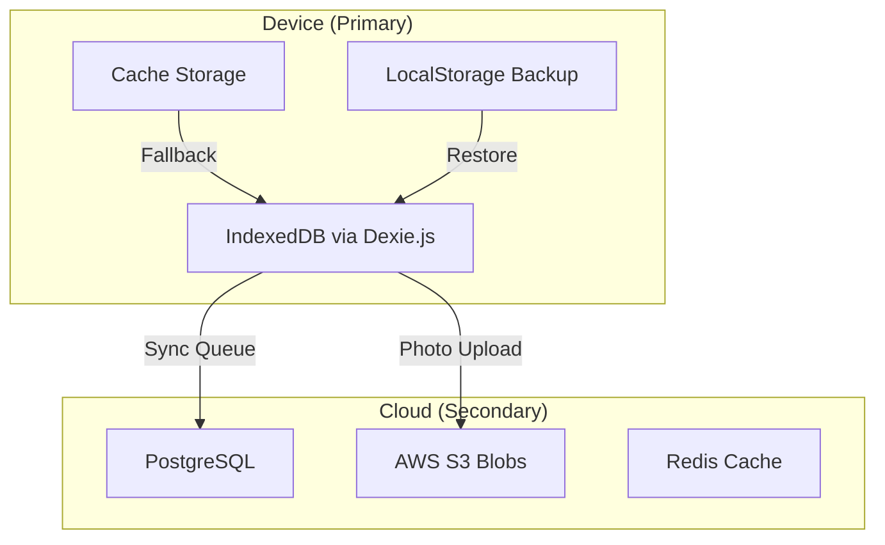

# ChecklistApp - Database Schema

> **Note**: This document describes the complete database architecture for future phases. The MVP uses JSON files for template storage and does not require a database. PostgreSQL and Prisma will be added in Phase 2.

## Overview

The database design (future implementation) will support user management, checklist persistence, and advanced features. The MVP operates without a database, using static JSON files for templates.

## Database Architecture



## IndexedDB Schema (Primary Database)

### Database Structure
```typescript
// lib/db.ts
import Dexie, { Table } from 'dexie';

class ChecklistDatabase extends Dexie {
  // Core tables
  checklists!: Table<IChecklist>;
  rooms!: Table<IRoom>;
  tasks!: Table<ITask>;
  photos!: Table<IPhoto>;
  
  // Sync & queue tables
  syncQueue!: Table<ISyncOperation>;
  conflicts!: Table<IConflict>;
  
  // Cache tables
  aiResponses!: Table<IAIResponse>;
  templates!: Table<ITemplate>;
  
  // User & settings
  users!: Table<IUser>;
  settings!: Table<ISetting>;

  constructor() {
    super('ChecklistApp');
    
    this.version(1).stores({
      // Core tables with indexes
      checklists: '++id, clientId, buildingId, status, createdAt, syncedAt',
      rooms: '++id, checklistId, name, status, order',
      tasks: '++id, roomId, name, completed, priority',
      photos: '++id, taskId, type, uploadStatus, capturedAt',
      
      // Sync tables
      syncQueue: '++id, entity, operation, priority, attempts',
      conflicts: '++id, entity, entityId, resolvedAt',
      
      // Cache tables
      aiResponses: '++id, type, input, createdAt',
      templates: '++id, category, name, isDefault',
      
      // User tables
      users: '++id, email, role',
      settings: 'key'
    });
  }
}
```

### Core Entities

#### Checklists Table
```typescript
interface IChecklist {
  id?: string;                    // Auto-generated UUID
  clientId: string;                // PerfexCRM client ID
  buildingId: string;              // Building identifier
  name: string;                    // "Office Building - 2024-01-15"
  status: ChecklistStatus;         // draft | active | completed | synced
  type: ChecklistType;             // regular | deep | moveout | movein
  
  // Metadata
  createdAt: Date;
  modifiedAt: Date;
  startedAt?: Date;
  completedAt?: Date;
  syncedAt?: Date;
  
  // Location
  location: {
    address: string;
    coordinates: [number, number];
    accuracy: number;
  };
  
  // Assignment
  assignedTo: string[];            // User IDs
  supervisorId?: string;
  
  // Estimates
  estimatedTime: number;           // Minutes
  actualTime?: number;
  
  // Sync
  remoteId?: string;               // PerfexCRM project ID
  syncStatus: SyncStatus;
  lastSyncAttempt?: Date;
}

enum ChecklistStatus {
  DRAFT = 'draft',
  ACTIVE = 'active',
  COMPLETED = 'completed',
  SYNCED = 'synced'
}
```

#### Rooms Table
```typescript
interface IRoom {
  id?: string;
  checklistId: string;             // Foreign key
  name: string;                    // "Master Bedroom"
  type: RoomType;                  // bedroom | bathroom | kitchen | etc
  status: RoomStatus;              // pending | in_progress | completed
  order: number;                   // Display order
  
  // Details
  size?: string;                   // "Large", "20m²"
  condition: ConditionLevel;       // clean | light | moderate | heavy
  notes?: string;
  
  // Timing
  estimatedTime: number;           // Minutes
  startedAt?: Date;
  completedAt?: Date;
  actualTime?: number;
  
  // Photos
  beforePhotoId?: string;
  afterPhotoId?: string;
  
  // Sync
  remoteId?: string;               // PerfexCRM milestone ID
}

enum RoomType {
  BEDROOM = 'bedroom',
  BATHROOM = 'bathroom',
  KITCHEN = 'kitchen',
  LIVING_ROOM = 'living_room',
  OFFICE = 'office',
  HALLWAY = 'hallway',
  OTHER = 'other'
}
```

#### Tasks Table
```typescript
interface ITask {
  id?: string;
  roomId: string;                  // Foreign key
  checklistId: string;             // Denormalized for queries
  name: string;                    // "Clean mirrors"
  description?: string;            // Detailed instructions
  
  // Status
  completed: boolean;
  completedAt?: Date;
  completedBy?: string;
  skipped: boolean;
  skipReason?: string;
  
  // Priority & order
  priority: Priority;              // critical | high | medium | low
  order: number;
  isRequired: boolean;
  
  // Validation
  requiresPhoto: boolean;
  requiresSignature: boolean;
  requiresNote: boolean;
  
  // Data
  note?: string;
  signature?: string;              // Base64 signature
  
  // Supplies
  supplies: string[];              // ["Glass cleaner", "Microfiber cloth"]
  
  // Quality
  qualityScore?: number;           // 0-100 from AI validation
  qualityFeedback?: string[];
  
  // Sync
  remoteId?: string;               // PerfexCRM task ID
  customFields?: Record<string, any>;
}

enum Priority {
  CRITICAL = 'critical',
  HIGH = 'high',
  MEDIUM = 'medium',
  LOW = 'low'
}
```

#### Photos Table
```typescript
interface IPhoto {
  id?: string;
  taskId?: string;                 // Optional, can be room-level
  roomId?: string;
  checklistId: string;
  
  // Type
  type: PhotoType;                 // before | after | issue | signature
  category?: string;               // "damage", "quality", "completion"
  
  // Blob data
  blob: Blob;                      // Original photo
  thumbnail: Blob;                 // Compressed thumbnail
  
  // Metadata
  metadata: {
    width: number;
    height: number;
    size: number;                  // Bytes
    mimeType: string;
    orientation: number;           // EXIF orientation
  };
  
  // Capture info
  capturedAt: Date;
  capturedBy: string;
  location?: [number, number];
  
  // Annotations
  annotations?: Array<{
    x: number;
    y: number;
    text: string;
  }>;
  
  // Upload
  uploadStatus: UploadStatus;
  uploadedAt?: Date;
  remoteUrl?: string;              // S3 URL
  thumbnailUrl?: string;
  uploadAttempts: number;
  lastUploadError?: string;
}

enum PhotoType {
  BEFORE = 'before',
  AFTER = 'after',
  ISSUE = 'issue',
  SIGNATURE = 'signature'
}

enum UploadStatus {
  PENDING = 'pending',
  UPLOADING = 'uploading',
  UPLOADED = 'uploaded',
  FAILED = 'failed'
}
```

### Sync & Queue Tables

#### Sync Queue
```typescript
interface ISyncOperation {
  id?: string;
  entity: EntityType;              // checklist | room | task | photo
  entityId: string;
  operation: Operation;            // create | update | delete
  priority: number;                // 0-10, higher = more important
  
  // Payload
  data: any;                       // Entity data to sync
  previousData?: any;              // For conflict detection
  
  // Attempts
  attempts: number;
  maxAttempts: number;
  lastAttempt?: Date;
  nextAttempt?: Date;
  
  // Error handling
  lastError?: string;
  errorCount: number;
  
  // Status
  status: QueueStatus;
  createdAt: Date;
  processedAt?: Date;
}

enum QueueStatus {
  PENDING = 'pending',
  PROCESSING = 'processing',
  COMPLETED = 'completed',
  FAILED = 'failed',
  CANCELLED = 'cancelled'
}
```

#### Conflicts Table
```typescript
interface IConflict {
  id?: string;
  entity: EntityType;
  entityId: string;
  
  // Conflict data
  localData: any;
  remoteData: any;
  baseData?: any;                  // Original version
  
  // Metadata
  detectedAt: Date;
  localModifiedAt: Date;
  remoteModifiedAt: Date;
  
  // Resolution
  resolution?: Resolution;
  resolvedAt?: Date;
  resolvedBy?: string;
  mergedData?: any;
  
  // User choice
  autoResolvable: boolean;
  severity: ConflictSeverity;
}

enum ConflictSeverity {
  LOW = 'low',        // Can auto-resolve
  MEDIUM = 'medium',  // Needs review
  HIGH = 'high'       // Must manually resolve
}
```

### Cache Tables

#### AI Responses Cache
```typescript
interface IAIResponse {
  id?: string;
  type: AIResponseType;            // room_analysis | checklist | validation
  
  // Request
  input: string;                   // Hash of input (photo/prompt)
  request: any;                    // Full request data
  
  // Response
  response: any;                   // AI response data
  confidence: number;              // 0-1
  
  // Metadata
  createdAt: Date;
  expiresAt: Date;
  hitCount: number;
  lastAccessedAt: Date;
  
  // Cost tracking
  tokens?: number;
  cost?: number;
}
```

#### Templates Cache
```typescript
interface ITemplate {
  id?: string;
  category: string;                // "office", "residential", "medical"
  name: string;
  description: string;
  isDefault: boolean;
  isCustom: boolean;
  
  // Template data
  rooms: Array<{
    type: RoomType;
    tasks: Array<{
      name: string;
      description: string;
      estimatedTime: number;
      supplies: string[];
    }>;
  }>;
  
  // Metadata
  version: number;
  createdAt: Date;
  updatedAt: Date;
  usageCount: number;
  rating?: number;
}
```

### User & Settings Tables

#### Users Table
```typescript
interface IUser {
  id?: string;
  email: string;
  name: string;
  role: UserRole;                  // cleaner | supervisor | admin
  
  // Profile
  phone?: string;
  photo?: string;
  language: string;                // "en", "es"
  
  // Auth
  authToken?: string;              // Encrypted
  refreshToken?: string;
  biometricEnabled: boolean;
  pinCode?: string;                // Hashed
  
  // Preferences
  preferences: {
    theme: 'light' | 'dark' | 'auto';
    fontSize: 'small' | 'medium' | 'large';
    soundEnabled: boolean;
    vibrationEnabled: boolean;
  };
  
  // Stats
  checklistsCompleted: number;
  averageTime: number;
  qualityScore: number;
  
  // Sync
  lastSyncAt?: Date;
  remoteId?: string;
}
```

#### Settings Table
```typescript
interface ISetting {
  key: string;                     // Primary key
  value: any;
  type: 'string' | 'number' | 'boolean' | 'json';
  category: string;                // "app", "sync", "display"
  updatedAt: Date;
}

// Common settings
const settings = {
  'sync.interval': 300000,         // 5 minutes
  'sync.wifiOnly': false,
  'cache.maxSize': 104857600,      // 100MB
  'cache.maxAge': 2592000000,      // 30 days
  'photo.quality': 0.8,
  'photo.maxWidth': 1920,
  'api.claudeKey': 'encrypted',
  'api.perfexUrl': 'https://...',
};
```

## Cloud Database Schema (PostgreSQL)

### Sync Tables
```sql
-- Minimal cloud schema for sync coordination
CREATE TABLE checklists (
  id UUID PRIMARY KEY DEFAULT gen_random_uuid(),
  device_id VARCHAR(255) NOT NULL,
  local_id VARCHAR(255) NOT NULL,
  data JSONB NOT NULL,
  version INTEGER DEFAULT 1,
  created_at TIMESTAMPTZ DEFAULT NOW(),
  updated_at TIMESTAMPTZ DEFAULT NOW(),
  UNIQUE(device_id, local_id)
);

CREATE TABLE sync_log (
  id UUID PRIMARY KEY DEFAULT gen_random_uuid(),
  device_id VARCHAR(255) NOT NULL,
  entity_type VARCHAR(50) NOT NULL,
  entity_id VARCHAR(255) NOT NULL,
  operation VARCHAR(20) NOT NULL,
  timestamp TIMESTAMPTZ DEFAULT NOW(),
  success BOOLEAN DEFAULT true,
  error_message TEXT
);

-- Indexes for performance
CREATE INDEX idx_checklists_device ON checklists(device_id);
CREATE INDEX idx_checklists_updated ON checklists(updated_at);
CREATE INDEX idx_sync_log_device ON sync_log(device_id, timestamp);
```

## Data Migration Strategy

### Version Management
```typescript
class DatabaseMigration {
  async migrate() {
    const currentVersion = await this.getCurrentVersion();
    const migrations = this.getMigrations();
    
    for (const migration of migrations) {
      if (migration.version > currentVersion) {
        await migration.up();
        await this.setVersion(migration.version);
      }
    }
  }
  
  getMigrations() {
    return [
      {
        version: 2,
        up: async () => {
          // Add new indexes
          await db.version(2).stores({
            checklists: '++id, clientId, buildingId, status, createdAt, syncedAt, *assignedTo'
          });
        }
      }
    ];
  }
}
```

## Sync Strategy

### Conflict Resolution
```typescript
class ConflictResolver {
  resolve(local: any, remote: any): any {
    // Last-write-wins for most fields
    if (local.modifiedAt > remote.modifiedAt) {
      return local;
    }
    
    // But merge arrays (like task completion)
    if (Array.isArray(local.tasks)) {
      return {
        ...remote,
        tasks: this.mergeTasks(local.tasks, remote.tasks)
      };
    }
    
    return remote;
  }
  
  mergeTasks(local: Task[], remote: Task[]) {
    // Prefer completed tasks
    const merged = new Map();
    
    [...remote, ...local].forEach(task => {
      const existing = merged.get(task.id);
      if (!existing || task.completed) {
        merged.set(task.id, task);
      }
    });
    
    return Array.from(merged.values());
  }
}
```

## Performance Optimizations

### Indexes
- Compound indexes for common queries
- Partial indexes for filtered queries
- Array indexes for multi-value fields

### Query Optimization
```typescript
// Efficient pagination
async getChecklists(page: number, limit: number) {
  return db.checklists
    .where('status').anyOf(['active', 'completed'])
    .offset(page * limit)
    .limit(limit)
    .toArray();
}

// Bulk operations
async bulkUpdate(updates: Array<{id: string, data: any}>) {
  return db.transaction('rw', db.checklists, async () => {
    for (const update of updates) {
      await db.checklists.update(update.id, update.data);
    }
  });
}
```

## Storage Limits & Management

### Size Management
```typescript
class StorageManager {
  async checkStorage() {
    const estimate = await navigator.storage.estimate();
    const used = estimate.usage || 0;
    const quota = estimate.quota || 0;
    
    if (used / quota > 0.8) {
      await this.cleanup();
    }
  }
  
  async cleanup() {
    // Delete old completed checklists
    const cutoff = new Date();
    cutoff.setDate(cutoff.getDate() - 30);
    
    await db.checklists
      .where('completedAt').below(cutoff)
      .and(item => item.syncedAt !== undefined)
      .delete();
    
    // Compress old photos
    await this.compressOldPhotos();
  }
}
```

## Backup & Recovery

### Local Backup
```typescript
class BackupManager {
  async backup() {
    const data = {
      version: 1,
      timestamp: new Date(),
      checklists: await db.checklists.toArray(),
      rooms: await db.rooms.toArray(),
      tasks: await db.tasks.toArray(),
      settings: await db.settings.toArray()
    };
    
    // Store in localStorage as fallback
    localStorage.setItem('backup', JSON.stringify(data));
    
    // Also export to file
    return this.exportToFile(data);
  }
  
  async restore(backup: any) {
    await db.transaction('rw', 
      db.checklists, db.rooms, db.tasks, 
      async () => {
        // Clear existing data
        await db.checklists.clear();
        await db.rooms.clear();
        await db.tasks.clear();
        
        // Restore from backup
        await db.checklists.bulkAdd(backup.checklists);
        await db.rooms.bulkAdd(backup.rooms);
        await db.tasks.bulkAdd(backup.tasks);
      }
    );
  }
}
```

---

*This local-first database schema ensures ChecklistApp works flawlessly offline while maintaining data integrity and enabling seamless synchronization when connectivity is available.*