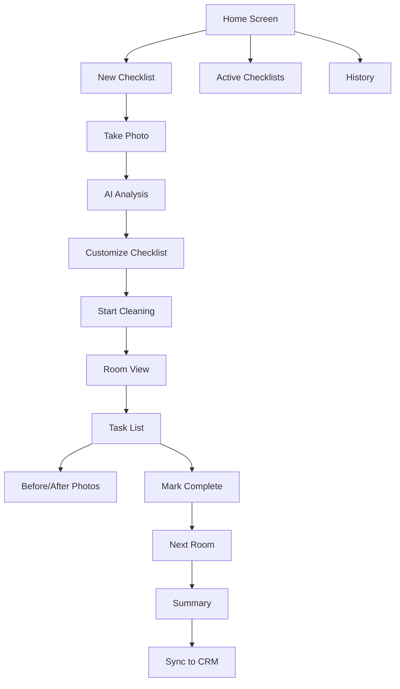

# ChecklistApp - UI/UX Design

## 🎯 Core Priority: Mobile-Responsive Design

> **CRITICAL**: Mobile-Responsive Design is Priority Feature #5 and MUST be fully implemented in Phase 1 (Weeks 1-10). This includes complete mobile optimization, touch interfaces, and responsive layouts for ALL device sizes.

## Design Philosophy

The UI/UX prioritizes simplicity and usability across all devices. The MVP interface focuses on clear navigation, intuitive template selection, and professional checklist output.

## Mobile-First Principles

### Core Design Principles
1. **Thumb-Friendly**: Primary actions within thumb reach zone
2. **Glove-Compatible**: Large touch targets (minimum 48x48px)
3. **High Contrast**: Readable in bright sunlight or dark rooms
4. **Instant Feedback**: Visual/haptic confirmation for every action
5. **Offline-First**: No dependency on network for core features
6. **Progressive Disclosure**: Show only what's needed now

## Information Architecture



## Screen Layouts

### 1. Home Screen
```
┌─────────────────────────┐
│ 📍 123 Main St     🔄   │ <- Location & Sync Status
├─────────────────────────┤
│                         │
│   [📸 Start New]        │ <- Primary CTA (Large)
│                         │
├─────────────────────────┤
│ Active Checklists (2)   │
├─────────────────────────┤
│ ┌─────────────────────┐ │
│ │ Office Building     │ │
│ │ 3/5 rooms • 45 min │ │ <- Progress indicator
│ └─────────────────────┘ │
│ ┌─────────────────────┐ │
│ │ Apartment 2B       │ │
│ │ 1/3 rooms • 20 min │ │
│ └─────────────────────┘ │
├─────────────────────────┤
│  [📊] [📷] [⚙️] [👤]   │ <- Bottom navigation
└─────────────────────────┘
```

### 2. Camera Capture Screen
```
┌─────────────────────────┐
│ ← Back          Guide   │
├─────────────────────────┤
│                         │
│    ┌───────────────┐    │
│    │               │    │ <- Camera viewfinder
│    │   [BATHROOM]  │    │ <- AI-detected room type
│    │               │    │
│    │   📷 Frame    │    │ <- Alignment guide
│    │   the room    │    │
│    │               │    │
│    └───────────────┘    │
│                         │
├─────────────────────────┤
│  Gallery  [📸]  Tips    │ <- Large capture button
└─────────────────────────┘
```

### 3. Room Checklist View
```
┌─────────────────────────┐
│ ← Bathroom      2/5 ✓   │ <- Room & progress
├─────────────────────────┤
│ ⏱ 15 min • 📷 Required │ <- Time & photo indicator
├─────────────────────────┤
│ ┌─────────────────────┐ │
│ │ ✅ Clean toilet     │ │ <- Completed task
│ └─────────────────────┘ │
│ ┌─────────────────────┐ │
│ │ ✅ Clean sink       │ │
│ └─────────────────────┘ │
│ ┌─────────────────────┐ │
│ │ ⬜ Clean mirror     │ │ <- Active task (highlighted)
│ │ 📷 Take photo      │ │
│ └─────────────────────┘ │
│ ┌─────────────────────┐ │
│ │ ⬜ Mop floor        │ │
│ └─────────────────────┘ │
├─────────────────────────┤
│ [Skip Room] [Next Room] │ <- Action buttons
└─────────────────────────┘
```

### 4. Task Detail Modal
```
┌─────────────────────────┐
│         Clean Mirror    │
├─────────────────────────┤
│ Instructions:           │
│ • Spray glass cleaner   │
│ • Wipe in circles       │
│ • Check for streaks     │
├─────────────────────────┤
│ Supplies:               │
│ 🧴 Glass cleaner        │
│ 🧻 Microfiber cloth     │
├─────────────────────────┤
│ ┌─────────┬───────────┐ │
│ │ Before  │  After    │ │
│ │ [📷]    │  [📷]     │ │ <- Photo capture
│ └─────────┴───────────┘ │
├─────────────────────────┤
│ Notes: ________________ │
├─────────────────────────┤
│ [Skip Task] [Complete]  │
└─────────────────────────┘
```

## Checklist Editing Interface

### CRITICAL: Full Editing Capability Required

All checklist generation methods MUST include comprehensive editing interfaces:

#### Template-Based Editing Screen
```
┌─────────────────────────┐
│ Select Rooms to Include │
├─────────────────────────┤
│ ☑ Kitchen (45 min)      │ <- Checkbox selection
│ ☑ Bathroom (30 min)     │
│ ☐ Bedroom (25 min)      │ <- Deselected room
│ ☑ Living Room (35 min)  │
├─────────────────────────┤
│ Selected: 3 rooms       │
│ Total time: 110 min     │
└─────────────────────────┘
```

#### Task Selection Within Room
```
┌─────────────────────────┐
│ Kitchen Tasks           │
├─────────────────────────┤
│ ☑ Clean countertops     │ <- Selected task
│ ☑ Clean appliances      │
│ ☐ Deep clean oven       │ <- Deselected
│ ☑ Mop floor            │
│ [+ Add Custom Task]     │ <- Add button
├─────────────────────────┤
│ [Edit Selected Tasks]   │
└─────────────────────────┘
```

#### Q&A Results Selection
```
┌─────────────────────────┐
│ Suggested Tasks         │
├─────────────────────────┤
│ Based on your answers:  │
│                         │
│ ☑ Vacuum carpets        │ <- Check what you need
│ ☑ Dust surfaces         │
│ ☐ Window cleaning       │ <- Skip unwanted
│ ☑ Sanitize bathroom     │
│ ☐ Polish wood floors    │
│                         │
│ [+ Add Missing Task]    │
├─────────────────────────┤
│ [Review & Edit]         │
└─────────────────────────┘
```

#### AI Detection Review
```
┌─────────────────────────┐
│ AI Detected Items       │
├─────────────────────────┤
│ Room: Bathroom (✓)      │ <- Confirm/Edit
│                         │
│ Detected Tasks:         │
│ ☑ Clean toilet          │
│ ☑ Clean sink           │
│ ☐ Clean bathtub        │ <- Remove if wrong
│ ☑ Mop floor            │
│                         │
│ Missed something?       │
│ [+ Add Task AI Missed]  │
├─────────────────────────┤
│ [Confirm & Continue]    │
└─────────────────────────┘
```

## Component Design System

### Color Palette
```scss
// Primary Colors (High Contrast)
$primary: #2563EB;        // Blue - Primary actions
$success: #10B981;        // Green - Completed tasks
$warning: #F59E0B;        // Amber - Warnings
$danger: #EF4444;         // Red - Errors/Critical
$neutral: #6B7280;        // Gray - Secondary text

// Background Colors
$bg-light: #FFFFFF;       // Main background
$bg-dark: #1F2937;        // Dark mode background
$surface: #F3F4F6;        // Card backgrounds

// Semantic Colors
$online: #10B981;         // Online indicator
$offline: #6B7280;        // Offline indicator
$syncing: #3B82F6;        // Syncing animation
```

### Typography
```scss
// Font Stack (System fonts for performance)
$font-family: -apple-system, BlinkMacSystemFont, "Segoe UI", Roboto, sans-serif;

// Font Sizes (Scaled for mobile)
$text-xs: 0.75rem;        // 12px - Captions
$text-sm: 0.875rem;       // 14px - Secondary text
$text-base: 1rem;         // 16px - Body text
$text-lg: 1.125rem;       // 18px - Headings
$text-xl: 1.25rem;        // 20px - Page titles
$text-2xl: 1.5rem;        // 24px - Large numbers

// Font Weights
$font-normal: 400;
$font-medium: 500;
$font-semibold: 600;
$font-bold: 700;
```

### Touch Targets
```scss
// Minimum sizes for touch targets
$touch-min: 48px;         // Minimum touch target
$touch-comfortable: 56px; // Comfortable touch target
$touch-large: 64px;       // Large touch target

// Button sizes
.button {
  min-height: $touch-min;
  padding: 12px 24px;
  
  &--large {
    min-height: $touch-large;
    padding: 16px 32px;
    font-size: $text-lg;
  }
  
  &--icon {
    width: $touch-min;
    height: $touch-min;
  }
}
```

## Interaction Patterns

### Gestures
```typescript
// Supported gestures
interface Gestures {
  tap: Action;           // Primary action
  longPress: Menu;       // Context menu
  swipeLeft: Delete;     // Delete/archive
  swipeRight: Complete;  // Mark complete
  swipeUp: Details;      // Show details
  swipeDown: Refresh;    // Pull to refresh
  pinch: Zoom;          // Photo zoom
}
```

### Haptic Feedback
```typescript
// Haptic patterns
const haptics = {
  success: 'light',      // Task completed
  warning: 'medium',     // Validation error
  error: 'heavy',        // Critical error
  selection: 'light',    // Item selected
};
```

### Animations
```scss
// Micro-animations for feedback
@keyframes check {
  0% { transform: scale(0); }
  50% { transform: scale(1.2); }
  100% { transform: scale(1); }
}

@keyframes pulse {
  0%, 100% { opacity: 1; }
  50% { opacity: 0.5; }
}

// Transition durations
$duration-instant: 100ms;
$duration-fast: 200ms;
$duration-normal: 300ms;
$duration-slow: 500ms;
```

## Responsive Breakpoints

### Device Targets
```scss
// Mobile-first breakpoints
$screen-xs: 320px;   // Small phones (iPhone SE)
$screen-sm: 375px;   // Standard phones (iPhone 12)
$screen-md: 414px;   // Large phones (iPhone Plus)
$screen-lg: 768px;   // Tablets (iPad Mini)
$screen-xl: 1024px;  // Large tablets (iPad Pro)

// Orientation handling
@media (orientation: landscape) {
  .bottom-nav {
    position: fixed;
    right: 0;
    bottom: auto;
    width: 80px;
    height: 100vh;
  }
}
```

## Accessibility Features

### WCAG 2.1 AA Compliance
```typescript
// Accessibility requirements
interface A11y {
  minContrastRatio: 4.5;     // Text contrast
  minTouchTarget: 44;         // iOS minimum
  focusIndicator: '2px solid'; // Visible focus
  screenReader: 'ARIA labels'; // Screen reader support
  reducedMotion: boolean;      // Respect preferences
}
```

### Voice Control
```html
<!-- Voice-friendly markup -->
<button 
  aria-label="Mark bathroom cleaning complete"
  data-voice-command="complete bathroom"
  class="task-complete"
>
  ✓ Complete
</button>
```

## Offline States

### Connection Indicators
```tsx
// Connection status component
function ConnectionStatus() {
  return (
    <div className="connection-status">
      {isOnline ? (
        <span className="online">🟢 Online</span>
      ) : (
        <span className="offline">🔴 Offline Mode</span>
      )}
      {isSyncing && (
        <span className="syncing">🔄 Syncing...</span>
      )}
    </div>
  );
}
```

### Offline UI Adaptations
- Disable cloud-dependent features
- Show cached data indicators
- Queue actions for sync
- Display last sync timestamp

## Loading & Error States

### Skeleton Screens
```tsx
// Skeleton loading state
function ChecklistSkeleton() {
  return (
    <div className="skeleton">
      <div className="skeleton-header" />
      <div className="skeleton-item" />
      <div className="skeleton-item" />
      <div className="skeleton-item" />
    </div>
  );
}
```

### Error Handling
```tsx
// Error display component
function ErrorMessage({ error, retry }) {
  return (
    <div className="error-message">
      <span className="error-icon">⚠️</span>
      <p>{error.message}</p>
      <button onClick={retry} className="retry-button">
        Try Again
      </button>
    </div>
  );
}
```

## Navigation Patterns

### Bottom Navigation
```tsx
// Fixed bottom navigation
function BottomNav() {
  return (
    <nav className="bottom-nav">
      <NavItem icon="📊" label="Dashboard" />
      <NavItem icon="📷" label="Camera" primary />
      <NavItem icon="📋" label="Tasks" />
      <NavItem icon="👤" label="Profile" />
    </nav>
  );
}
```

### Swipe Navigation
```typescript
// Swipe between rooms
const swipeHandlers = useSwipeable({
  onSwipedLeft: () => navigateToNextRoom(),
  onSwipedRight: () => navigateToPreviousRoom(),
  preventDefaultTouchmoveEvent: true,
  trackMouse: false
});
```

## Performance Optimizations

### Image Handling
```typescript
// Optimized image loading
const ImageOptimizer = {
  compress: (blob: Blob): Promise<Blob> => {
    // Compress to max 500KB
    return compressImage(blob, {
      maxWidth: 1920,
      maxHeight: 1080,
      quality: 0.8
    });
  },
  
  generateThumbnail: (blob: Blob): Promise<Blob> => {
    return compressImage(blob, {
      maxWidth: 200,
      maxHeight: 200,
      quality: 0.6
    });
  }
};
```

### Lazy Loading
```tsx
// Lazy load non-critical components
const PhotoGallery = lazy(() => import('./PhotoGallery'));
const ReportGenerator = lazy(() => import('./ReportGenerator'));
```

## Dark Mode Support

### Automatic Theme Switching
```scss
// System preference detection
@media (prefers-color-scheme: dark) {
  :root {
    --bg-primary: #1F2937;
    --text-primary: #F9FAFB;
    --surface: #374151;
  }
}

// Manual theme toggle
[data-theme="dark"] {
  --bg-primary: #1F2937;
  --text-primary: #F9FAFB;
}
```

## Localization

### Multi-Language Support
```typescript
// Language configuration
const languages = {
  en: { complete: 'Complete', skip: 'Skip' },
  es: { complete: 'Completar', skip: 'Omitir' },
  pl: { complete: 'Zakończ', skip: 'Pomiń' }
};
```

## Testing Considerations

### User Testing Metrics
- Task completion time < 2 seconds
- Error rate < 5%
- Satisfaction score > 4.5/5
- One-handed operation success > 90%
- Offline functionality 100%

---

*This mobile-first UI/UX design ensures ChecklistApp provides an intuitive, efficient, and reliable experience for cleaning professionals working in challenging field conditions.*